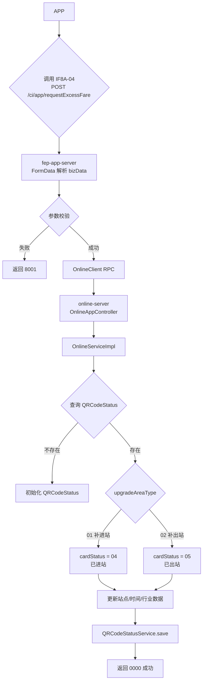
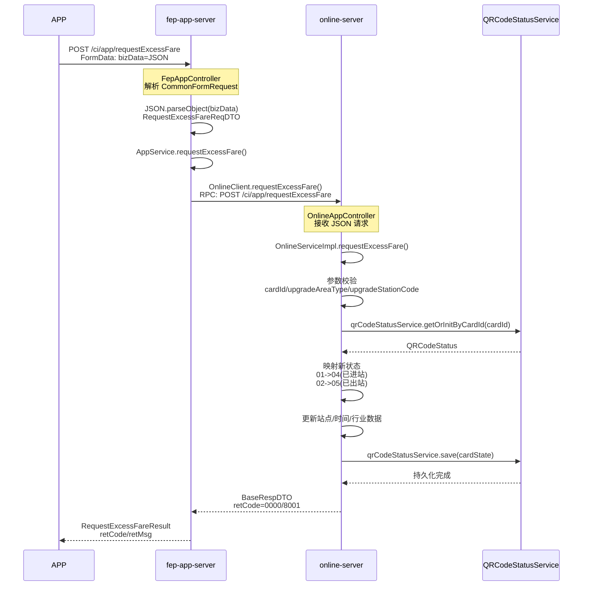

# IF8A-04 请求自助补站实现记录

> 生成日期：2026-06-26  
> 最后更新：2026-06-26（实现在 online-server）  
> 关联计划：`docs/未实现服务开发计划.md` Phase 1.2

---

## 1. 规范信息

| 项目 | 内容 |
|------|------|
| 规范编号 | IF8A-04 |
| 接口名称 | 请求自助补站 |
| 请求路径 | `POST /ci/app/requestExcessFare` |
| 调用方 | APP |
| 接收方 | fep-app-server → online-server |

---

## 2. 请求参数

| 字段 | 类型 | 必填 | 说明 |
|------|------|------|------|
| thirdUserId | string | 是 | 第三方用户id |
| cardId | String | 是 | 地铁会员卡号 |
| cardType | String | 是 | 卡类型编码 |
| upgradeAreaType | String | 是 | 01：补进站 02：补出站 |
| upgradeStationCode | String | 是 | 补进/出站编码 |
| upgradeReason | String | 否 | 更新原因预留 |
| upgradeDateTime | String | 否 | 更新操作时间 YYYYMMDDHHmmss |

---

## 3. 应答参数

| 字段 | 类型 | 说明 |
|------|------|------|
| retCode | string | 返回码 |
| retMsg | string | 返回消息 |

---

## 4. 错误码

| 错误码 | 含义 | 说明 |
|--------|------|------|
| 0000 | 成功 | - |
| 9999 | 失败 | - |
| 8001 | 无效的参数 | cardId/upgradeAreaType/upgradeStationCode 为空 |
| 8304 | 没有进站记录，无法补出站 | 补出站（02）时，二维码状态中 gateInTime 为空 |

---

## 5. 调用链路

```
APP
 → fep-app-server (/ci/app/requestExcessFare)
   → OnlineClient RPC
     → online-server (/ci/app/requestExcessFare)
       → OnlineServiceImpl.requestExcessFare()
         → QRCodeStatusService.getOrInitByCardId() / save()
```

**架构说明**：补站业务由 online-server 承载。理由：online-server 已统一维护 QRCodeStatus 票卡状态快照，与 BOM 票卡分析/更新（IF5A-01/03）同属票卡状态修正域，放在 online-server 职责边界更清晰。

---

## 6. 涉及服务

| 服务 | 模块 | 角色 |
|------|------|------|
| fep-app-server | 接口网关 | APP 请求入口，FormData 解析后透传 |
| online-server | 业务实现 | 补站核心逻辑，更新 QRCodeStatus |
| rpc | 通信模块 | 提供 OnlineClient，供 fep-app-server 调用 online-server |

---

## 7. 代码清单

### 7.1 新增文件

| 文件路径 | 说明 |
|----------|------|
| `model/src/main/java/com/chinasofti/huateng/model/app/RequestExcessFareReqDTO.java` | APP 请求参数 DTO |
| `model/src/main/java/com/chinasofti/huateng/model/app/RequestExcessFareResult.java` | APP 应答 DTO |
| `rpc/src/main/java/com/chinasofti/huateng/rpc/online/OnlineClient.java` | online-server RPC 客户端 |
| `online-server/src/main/java/com/chinasofti/huateng/online/controller/OnlineAppController.java` | APP 接口控制器 |
| `online-server/src/main/java/com/chinasofti/huateng/online/model/app/RequestExcessFareReqDTO.java` | 服务端请求 DTO |

### 7.2 修改文件

| 文件路径 | 变更内容 |
|----------|----------|
| `fep-app-server/.../controller/FepAppController.java` | 新增 `/requestExcessFare` 接口 |
| `fep-app-server/.../service/AppService.java` | 新增 `requestExcessFare` 方法 |
| `fep-app-server/.../service/impl/AppServiceImpl.java` | 实现方法，调用 onlineClient |
| `online-server/.../service/OnlineService.java` | 新增 `requestExcessFare` 接口方法 |
| `online-server/.../service/impl/OnlineServiceImpl.java` | 实现补站业务逻辑 |

---

## 8. 业务逻辑

1. **参数校验**：检查 cardId、upgradeAreaType、upgradeStationCode 是否为空
2. **获取票卡状态**：按 cardId 从 online-server 的 QRCodeStatus 获取或初始化
3. **映射新状态**：
   - 01 补进站 → cardStatus = 04（已进站）
   - 02 补出站 → cardStatus = 05（已出站）
4. **更新信息**：lastStationCode、lastHandleDateTime、lastTransAmount、industryData
5. **落库保存**：调用 QRCodeStatusService.save() 持久化

---

## 9. 测试验证

```bash
# 编译验证
mvn clean compile -DskipTests -pl model,rpc,online-server,fep-app-server -am

# 接口调用示例
curl -X POST http://localhost:8080/ci/app/requestExcessFare \
  -H "Content-Type: application/x-www-form-urlencoded" \
  -d "providerId=01&charset=UTF-8&format=json&timestamp=20260626120000&deviceId=APP&signType=00&sign=&bizData={\"thirdUserId\":\"1001\",\"cardId\":\"9900000000000001\",\"cardType\":\"0441\",\"upgradeAreaType\":\"01\",\"upgradeStationCode\":\"0101\",\"upgradeDateTime\":\"20260626120000\"}"
```

---

## 10. 待确认事项

| 序号 | 问题 | 结论 | 理由 |
|------|------|------|------|
| 1 | 补站是否需要调用 BOM/ACC 真实接口？ | **当前仅更新平台状态** | Phase 1 以最小可用实现跑通流程，BOM/ACC 真实联调留在 Phase 2；当前通过更新 QRCodeStatus 模拟补站结果，满足 APP 侧状态查询和生码需求 |
| 2 | 是否需要校验用户黑名单/解约审核中状态？ | **Phase 1 暂不校验，Phase 2 再补** | ① 补站由 online-server 执行，账户状态由 account-server 管理，加入校验会新增服务间依赖；② 补站是票卡状态修正，对账户状态依赖较弱；③ 规范 IF8A-04 章节未明确要求前置账户校验，错误码 8005/8008 更多关联开户、解约场景 |
| 3 | 补站后是否需要推送行业数据更新（IF8B-01）？ | **不需要主动推送，APP 通过 IF8A-03 拉取** | ① IF8B-01 设计上是 ticket-server 在闸机检票后异步推送，补站是 APP 主动发起，不需要平台反向推送；② 补站已更新 `QRCodeStatus.industryData`，APP 可立即调用 IF8A-03 主动拉取；③ 若触发 IF8B-01，会引入不必要的跨服务调用，且时机不匹配 |
| 4 | 费用扣减、超时判断、日票逻辑是否在 Phase 1 实现？ | **Phase 2 再补** | 补站入口只负责修正状态，费用计算由专门计费服务异步处理，职责分离，规则复杂度高需统一规则引擎支撑 |

**后续可补充场景：**
- 若业务方明确要求“黑名单用户禁止补站”，可在 `fep-app-server` 的 `AppServiceImpl.requestExcessFare()` 中前置调用 `accountClient.queryUserInfo()` 校验
- 若产品要求“补站后自动刷新 APP 生码”，在 APP 侧监听补站响应后主动调用 IF8A-03 即可，无需平台侧推送

---

## 11. 用户须知/业务规则

| 序号 | 规则 | 实现方案 | 负责域 |
|------|------|----------|--------|
| 1 | 补站后自动扣减费用 | 补站成功后发布 `EXCESS_FARE_COMPLETED` 事件，计费服务异步消费并调用支付/ACC扣款 | 计费域 + ACC |
| 2 | 电子日票扣减使用次数 | 事件消费者调用日票服务校验剩余次数并扣减；次数不足或过期则按里程计费 | 日票服务 |
| 3 | 240 分钟超时规则 | 计算进闸时间（gateInTime）到补站时间的差值，超过 240 分钟标记超时 | 计费域 |
| 4 | 超时交线网最高单程票价费用 | 规则引擎根据超时时长、站点、线路计算最高单程票价并生成补缴订单 | 规则引擎 + 计费域 |
| 5 | 电子日票超时补扣 1 次 | 日票服务特殊规则：超时情况下额外扣减 1 次使用次数 | 日票服务 |

**事件定义建议：**

```json
{
  "eventType": "EXCESS_FARE_COMPLETED",
  "data": {
    "cardId": "0178236640760822",
    "cardType": "0441",
    "upgradeAreaType": "01",
    "upgradeStationCode": "0121",
    "upgradeDateTime": "20260626115438",
    "isOverdue": false,
    "overdueMinutes": 0
  }
}
```

---

## 14. 待确认事项

| 序号 | 问题 | 结论 | 理由 |
|------|------|------|------|
| 1 | 补站是否需要调用 BOM/ACC 真实接口？ | **当前仅更新平台状态** | Phase 1 以最小可用实现跑通流程，BOM/ACC 真实联调留在 Phase 2；当前通过更新 QRCodeStatus 模拟补站结果，满足 APP 侧状态查询和生码需求 |
| 2 | 是否需要校验用户黑名单/解约审核中状态？ | **Phase 1 暂不校验，Phase 2 再补** | ① 补站由 ticket-server 执行，账户状态由 account-server 管理，加入校验会新增服务间依赖；② 补站是票卡状态修正，对账户状态依赖较弱；③ 规范 IF8A-04 章节未明确要求前置账户校验，错误码 8005/8008 更多关联开户、解约场景 |
| 3 | 补站后是否需要推送行业数据更新（IF8B-01）？ | **不需要主动推送，APP 通过 IF8A-03 拉取** | ① IF8B-01 设计上是 ticket-server 在闸机检票后异步推送，补站是 APP 主动发起，不需要平台反向推送；② 补站已更新 `QRCodeStatus.industryData`，APP 可立即调用 IF8A-03 主动拉取；③ 若触发 IF8B-01，会引入不必要的跨服务调用，且时机不匹配 |
| 4 | 费用扣减、超时判断、日票逻辑是否在 Phase 1 实现？ | **Phase 2 再补** | 补站入口只负责修正状态，费用计算由专门计费服务异步处理，职责分离，规则复杂度高需统一规则引擎支撑 |

**后续可补充场景**：
- 若业务方明确要求“黑名单用户禁止补站”，可在 `fep-app-server` 的 `AppServiceImpl.requestExcessFare()` 中前置调用 `accountClient.queryUserInfo()` 校验
- 若产品要求“补站后自动刷新 APP 生码”，在 APP 侧监听补站响应后主动调用 IF8A-03 即可，无需平台侧推送

---

## 11. 用户须知/业务规则

以下为补站功能向用户展示的提示文案，也是平台扣款的业务依据：

- 请按照实际乘坐车站选择进/出站信息。
- 系统将会按照自助选择的进出站信息进行扣款，所有自助补站操作均有可能产生费用。
- 谨慎使用自助补站功能，在乘车功能正常的情况下，请勿使用此功能。
- 如自助补站功能无法使用，请联系车站工作人员处理。
- 如对自助补站后产生的费用有异议，可拨打 0532-55661111 进行反馈。
- 在您完成补站后，系统会依据您的行程自动扣减费用或扣减电子日票的使用次数。
  - 若使用电子日票进行的乘车订单，默认将扣除电子日票的使用次数。
  - 若使用次数不足或日票已过期，则将需要按实际里程支付费用。
- 按《青岛地铁票务规则》规定：每次乘车从进闸到出闸，时限为 240 分钟。
  - 当您超过此时间，补站后除须扣除当次车程费用外，还须交线网最高单程票价的超时费用。
  - 电子日票除扣除当次行程次数外，还须补扣 1 次乘车次数。
- **补出站前必须存在有效的进站记录**。若您未刷卡进站，请先联系车站工作人员处理。

---

## 12. 业务流程



---

## 13. 时序图


