# IF8B-02 解约结果通知

> 来源：`10-业务规范与标准/原始归档/青岛地铁-ITP与APP接口规范R6.docx`

## 接口地址

`http//:[ip]:[port]/[project]/ticket/receiveTerminationResultFromItp`

## 流程说明

- APP_SERVER发送请求解约申请到ITP平台。
- ITP接收到解约请求后。
- 如验证请求参数（基础参数、合作伙伴信息及签名）验证失败，则返回retCode：8001；
- 如验证用户是未注册用户，则返回retCode:8004；
- 如验证用户状态为解约审核中，则返回retCode:8008；
- 如验证用户卡号是否与请求的卡号参数不一致，则返回retCode:8006；
- 标记用户为待解约审核中状态，处理完成后返回retCode:0000；
- 业务处理过程中出现异常时，则返回retCode:9999。
- ITP返回请求结果给APP_SERVER（解约结果等待审批结束）。
- ITP在单边扣费周期结束后，将解约请求发送给支付通道。
- 支付通道把解约结果返回给ITP平台。
- ITP把解约结果推送给APP_SERVER。
- 乘客在付费区，不可以发起解约。

```mermaid
flowchart LR
    Step0[APP_SERVER发送请求解约申请到ITP平台。]
    Step1[ITP接收到解约请求后。]
    Step2[如验证请求参数（基础参数、合作伙伴信息及签名）验证失败，则返回retCode：8001；]
    Step3[如验证用户是未注册用户，则返回retCode:8004；]
    Step4[如验证用户状态为解约审核中，则返回retCode:8008；]
    Step5[如验证用户卡号是否与请求的卡号参数不一致，则返回retCode:8006；]
    Step6[标记用户为待解约审核中状态，处理完成后返回retCode:0000；]
    Step7[业务处理过程中出现异常时，则返回retCode:9999。]
    Step8[ITP返回请求结果给APP_SERVER（解约结果等待审批结束）。]
    Step9[ITP在单边扣费周期结束后，将解约请求发送给支付通道。]
    Step10[支付通道把解约结果返回给ITP平台。]
    Step11[ITP把解约结果推送给APP_SERVER。]
    Step12[乘客在付费区，不可以发起解约。]
    Step0 --> Step1
    Step1 --> Step2
    Step2 --> Step3
    Step3 --> Step4
    Step4 --> Step5
    Step5 --> Step6
    Step6 --> Step7
    Step7 --> Step8
    Step8 --> Step9
    Step9 --> Step10
    Step10 --> Step11
    Step11 --> Step12
```

> 注：流程图基于原始文档图8，具体步骤请参考上方流程说明。

## 请求参数

| 字段 | 类型 | 说明 |
| --- | --- | --- |
| thirdUserId | string | 第三方用户id |
| cardId | String | 地铁会员卡号 |
| cardType | String | 2.8	卡类型编码 |

## 应答参数

| 字段 | 类型 | 说明 |
| --- | --- | --- |
| retCode | string | 返回码 |
| retMsg | string | 返回消息 |
| cardData | string | 行业数据 编码格式Hexstring |
| signType | string | 00：不签名 01：sha1withrsa 02：MD5 |
| sign | string | 私钥签名sha1withrsa |
