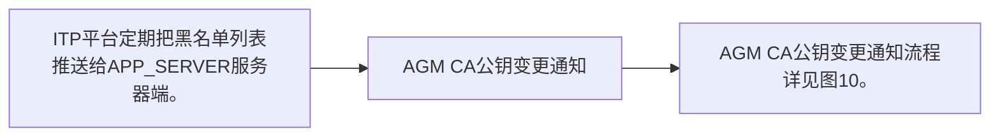

# IF8B-03 黑名单结果通知

> 来源：`10-业务规范与标准/原始归档/青岛地铁-ITP与APP接口规范R6.docx`

## 接口地址

`http//:[ip]:[port]/[project]/app/receiveBlackListFromItp`

## 流程说明

- ITP平台定期把黑名单列表推送给APP_SERVER服务器端。
- AGM CA公钥变更通知
- AGM CA公钥变更通知流程详见图10。

> 注：流程图基于原始文档图9，具体步骤请参考上方流程说明。

## 请求参数

| 字段 | 类型 | 说明 |
| --- | --- | --- |
| thirdUserId | string | 第三方用户id |
| cardId | String | 地铁会员卡号 支持多卡，逗号隔开 |
| cardType | String | 卡类型编码 |
| pageNumber | Int | 当前页 |
| pageSize | Int | 一页记录条数 |
| totalPage | Int | 总页数 |
| startDate | String | 开始日期 非必填 yyyy-MM-dd |
| endDate | String | 结束日期 非必填 yyyy-MM-dd |
| debitRequestResult | String | 扣款结果 空查全部，0查成功，1查失败 |
| ticketCode | String | 日票票号 |

## 应答参数

| 字段 | 类型 | 说明 |
| --- | --- | --- |
| retCode | string | 返回码 |
| retMsg | string | 返回消息 |
| pageNumber | string | 当前页 |
| pageSize | string | 一页记录条数 |
| totalPage | string | 总页数 |
| ticketTransRecord | json数组 |  |
| signType | string | 00：不签名 01：sha1withrsa 02：MD5 |
| sign | string | 私钥签名sha1withrsa |
