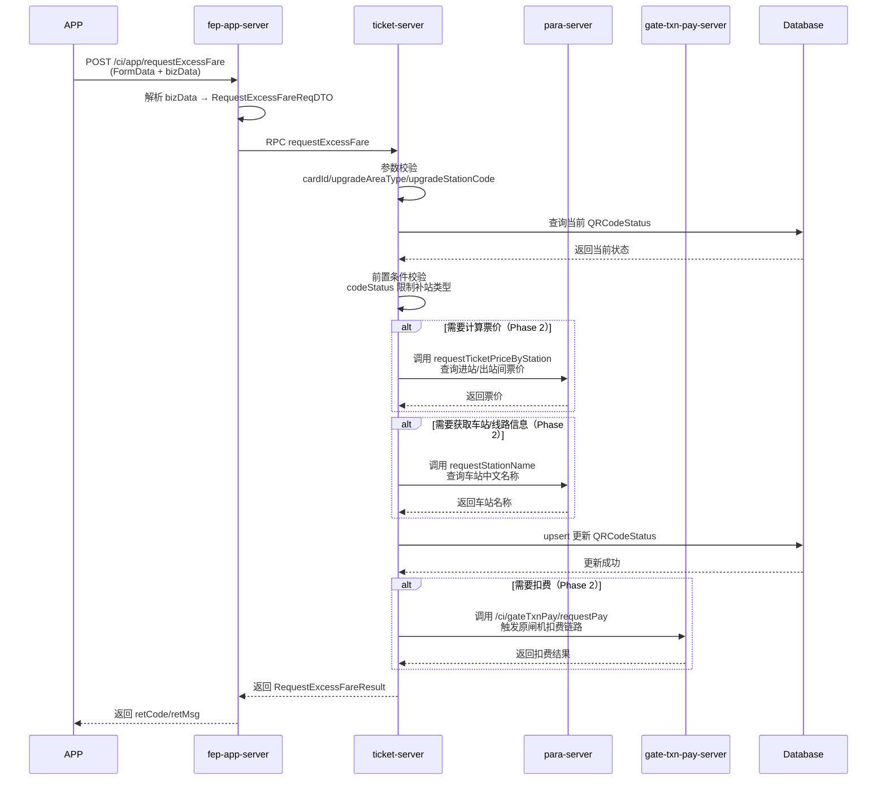

# IF8A-04 请求用户自助补站

> 来源：`10-业务规范与标准/原始归档/青岛地铁-ITP与APP接口规范R6.docx`

## 接口地址

`http//:[ip]:[port]/[project]/ci/app/requestExcessFare`

## 接口说明

APP请求ITP进行自助补票

## 业务流程时序图

## 计算票价（Phase 2）

补站成功后，如需向用户收取补站差价，需调用 **para-server** 计算票价：

| 项目 | 说明 |
|------|------|
| **接口路径** | `/ci/app/requestTicketPriceByStation` |
| **调用方** | `ticket-server` |
| **输入** | `entryStationCode`（补进站）/ `exitStationCode`（补出站） |
| **输出** | `ticketPrice`（票价，单位：分） |
| **实现状态** | ⚠️ Phase 2 待实现 |

> `para-server` 已实现票价查询能力，见 `AppParaServiceImpl.requestTicketPriceByStation()`。

## 获取其他信息（Phase 2）

补站过程中如需补充车站、线路等基础信息，调用 **para-server**：

| 接口路径 | 用途 | 实现状态 |
|---------|------|---------|
| `/ci/app/requestStationName` | 根据车站代码查询中文名称 | ✅ 已有 |
| `/ci/app/requestLineCodeList` | 获取线路代码列表 | ✅ 已有 |
| `/ci/app/requestStationCodeList` | 获取车站代码列表 | ✅ 已有 |
| `/ci/app/requestLineStationCodeVersion` | 获取线路/车站代码版本 | ✅ 已有 |

> `ticket-server` 已注入 `ParaClient`，可复用现有 RPC 能力。

## 扣费处理（Phase 2）

补站涉及费用追缴时，应调用原闸机扣费接口 **gate-txn-pay-server**：

| 项目 | 说明 |
|------|------|
| **接口路径** | `/ci/gateTxnPay/requestPay` |
| **调用方** | `ticket-server` |
| **请求对象** | `GateTxnPayReqDTO`（继承 `NotifyVerifyResultReqDTO`） |
| **响应对象** | `GateTxnPayRespDTO`（含 `retCode/retMsg/orderNo/payStatus`） |
| **实现状态** | ⚠️ Phase 2 待实现 |

### 扣费前置条件

1. `ticket-server` 需开启 `EnableRpcGateTxnPay` 并注入 `GateTxnPayClient`
2. `RequestExcessFareReqDTO` 需扩展金额相关字段（`trxAmount`、`overtimeAmount`、`ticketTransSeq` 等）
3. 需业务确认：补站是否允许复用闸机扣费链路

### 当前代码位置

- **现有扣费链路**：`fep-dev-server` 在 `IF1A-01 闸机检票通知` 出站交易时调用 `gate-txn-pay-server`
- **补站扣费扩展点**：`TicketRideStatusServiceImpl.requestExcessFare()` 成功后调用

## 请求参数

| 字段 | 类型 | 说明 |
| --- | --- | --- |
| thirdUserId | string | 第三方用户id |
| cardId | String | 地铁会员卡号 |
| cardType | String | 2.8 卡类型编码 |
| upgradeAreaType | String | 01：补进站 02：补出站 |
| upgradeStationCode | String | 补进/出站编码 |
| upgradeReason | String | 更新原因预留 |
| upgradeDateTime | String | 更新操作时间YYYYMMDD24mmss |

## 应答参数

| 字段 | 类型 | 说明 |
| --- | --- | --- |
| retCode | string | 返回码 |
| retMsg | string | 返回消息 |
