# IF8A-06 请求解约

> 来源：`10-业务规范与标准/原始归档/青岛地铁-ITP与APP接口规范R6.docx`

## 接口地址

`http//:[ip]:[port]/[project]/ci/app/requestTermination`

## 流程说明

- 乘客或APP_SERVER 发送解约申请到ITP平台。
- ITP接收到解约请求后。
- 如验证请求参数（基础参数、合作伙伴信息及签名）验证失败，则返回retCode：8001；
- 如验证用户是未注册用户，则返回retCode:8004；
- 如验证用户状态为解约审核中，则返回retCode:8008；
- 如验证用户卡号是否与请求的卡号参数不一致，则返回retCode:8006；
- 更新用户状态标识为解约状态，处理完成后返回retCode:0000；
- 业务处理过程中出现异常时，则返回retCode:9999。
- ITP平台返回请求解约结果。
- ITP等待平台扣费周期结束后向支付通道发起解约请求。
- 支付通道将解约结果返回给ITP平台。
- ITP将解约结果推送给APP_SERVER。

```mermaid
flowchart LR
    Step0[乘客或APP_SERVER 发送解约申请到ITP平台。]
    Step1[ITP接收到解约请求后。]
    Step2[如验证请求参数（基础参数、合作伙伴信息及签名）验证失败，则返回retCode：8001；]
    Step3[如验证用户是未注册用户，则返回retCode:8004；]
    Step4[如验证用户状态为解约审核中，则返回retCode:8008；]
    Step5[如验证用户卡号是否与请求的卡号参数不一致，则返回retCode:8006；]
    Step6[更新用户状态标识为解约状态，处理完成后返回retCode:0000；]
    Step7[业务处理过程中出现异常时，则返回retCode:9999。]
    Step8[ITP平台返回请求解约结果。]
    Step9[ITP等待平台扣费周期结束后向支付通道发起解约请求。]
    Step10[支付通道将解约结果返回给ITP平台。]
    Step11[ITP将解约结果推送给APP_SERVER。]
    Step0 --> Step1
    Step1 --> Step2
    Step2 --> Step3
    Step3 --> Step4
    Step4 --> Step5
    Step5 --> Step6
    Step6 --> Step7
    Step7 --> Step8
    Step8 --> Step9
    Step9 --> Step10
    Step10 --> Step11
```

> 注：流程图基于原始文档图6，具体步骤请参考上方流程说明。

## 请求参数

| 字段 | 类型 | 说明 |
| --- | --- | --- |
| lineCode | string | 线路代码 |
| stationCode | string | 站点代码 |
| stationNameZH | string | 站点名称(中文) |
| stationNameEN | string | 站点名称(英文) |
| transferYn | string | 是否换乘(Y/N) |

## 应答参数

| 字段 | 类型 | 说明 |
| --- | --- | --- |
