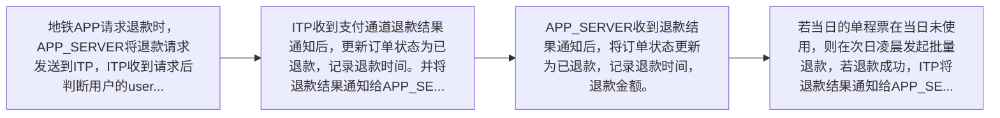

# IF8A-12 请求退款

> 来源：`10-业务规范与标准/原始归档/青岛地铁-ITP与APP接口规范R6.docx`

## 接口地址

`http//:[ip]:[port]/[project]/ci/app/requestRefundTicket`

## 流程说明

- 地铁APP请求退款时，APP_SERVER将退款请求发送到ITP，ITP收到请求后判断用户的user_id是否与订单信息中的user_id是否一致，如果不一致则返回8001，如果一致则判断订单状态是否为已支付状态，如果不是则返回8305，如果订单状态为已支付，则请求支付通道请求退款。
- ITP收到支付通道退款结果通知后，更新订单状态为已退款，记录退款时间。并将退款结果通知给APP_SERVER。
- APP_SERVER收到退款结果通知后，将订单状态更新为已退款，记录退款时间，退款金额。
- 若当日的单程票在当日未使用，则在次日凌晨发起批量退款，若退款成功，ITP将退款结果通知给APP_SERVER。

> 注：流程图基于原始文档图18，具体步骤请参考上方流程说明。

## 请求参数

| 字段 | 类型 | 说明 |
| --- | --- | --- |

## 应答参数

| 字段 | 类型 | 说明 |
| --- | --- | --- |
| retCode | string | 返回码 |
| retMsg | string | 返回消息 |
| lineCodeIdx | string | 线路版本号 |
| stationCodeIdx | string | 站点版本号 |
| changeDate | string | 更新日期 |
