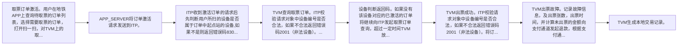

# IF8A-15 激活取票订单

> 来源：`10-业务规范与标准/原始归档/青岛地铁-ITP与APP接口规范R6.docx`

## 接口地址

`http//:[ip]:[port]/[project]/ci/tvm/requestActiveTicket`

## 接口说明

激活取票订单

## 流程说明

- 取票订单激活。用户在地铁APP上查询待取票的订单列表，选择需要取票的订单，打开扫一扫，对TVM上的取票码扫码，点击激活。
- APP_SERVER将订单激活请求发送到ITP。
- ITP收到激活订单的请求后先判断用户所扫的设备是否属于订单中起点站的设备,如果不是则返回错误码8306， 判断用户的user_id是否与订单信息中的user_id是否一致，如果不一致则返回8001，判断订单状态是否为已支付如果订单状态未支付则返回错误码8305。如果验证通过后将激活的订单号与设备编码和设备校验码绑定保存在数据库中。
- TVM查询取票订单。ITP校验请求对象中设备编号是否合法，如果不合法返回错误码2001（非法设备）。如果设备合法根据请求的设备编号及校验码查询已激活的订单，如果有已激活的订单，则返回订单信息。如果没有，则返回错误码2003。
- 设备判断返回码。如果没有该设备对应的已激活的订单将继续向ITP发起取票订单查询，超过一定时间TVM放弃查询。如果有已激活的订单则开始出票。
- TVM出票成功。ITP校验请求对象中设备编号是否合法，如果不合法返回错误码2001（非法设备）。将订单状态更新为已出票，记录出票时间，出票张数。向APP_SERVER推送出票结果。
- TVM出票故障。记录故障信息，及出票张数，出票时间，并计算未出票的金额向支付通道发起退款，根据支付通道返回的退款结果更新订单状态，如果退款成功将订单状态更新为已退款。向APP_SERVER推送退款结果。
- TVM生成本地交易记录。

> 注：流程图基于原始文档图19，具体步骤请参考上方流程说明。

## 请求参数

| 字段 | 类型 | 说明 |
| --- | --- | --- |
| userId | string | 用户编码 |
| orderNo | string | 订单号 |

## 应答参数

| 字段 | 类型 | 说明 |
| --- | --- | --- |
| retCode | string | 返回码 |
| retMsg | string | 返回消息 |
| orderNo | string | 订单号 |
| refundType | string | 00: 用户提交退款 01：超时未使用自动退款 |
| refundResult | string | SUCCESS/FAIL/PROCESSING SUCCESS—退款成功 FAIL—退款失败 PROCESSING-退款进行中 |
| refundResultDesc | string | 退款描述 |
| refundDate | string | 退款日期 |
| refundAmount | String | 退款金额 单位分 |
