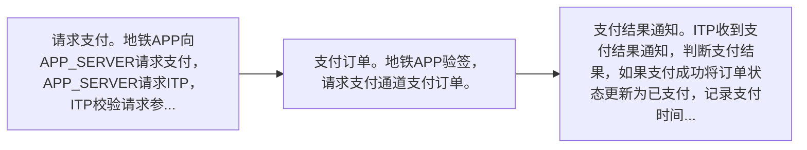

# IF8A-18 支付结果查询

> 来源：`10-业务规范与标准/原始归档/青岛地铁-ITP与APP接口规范R6.docx`

## 接口地址

`http//:[ip]:[port]/[project]/ci/app/requestPayResult`

## 流程说明

- 请求支付。地铁APP向APP_SERVER请求支付，APP_SERVER请求ITP，ITP校验请求参数合法性，若参数不合法则返回错误码8001。如果参数合法创建订单，根据支付通道编码payChannelCode，创建商户订单号，请求对应的支付通道预下单，将预下单返回的支付信息签名，将签名后的订单信息返回。
- 支付订单。地铁APP验签，请求支付通道支付订单。
- 支付结果通知。ITP收到支付结果通知，判断支付结果，如果支付成功将订单状态更新为已支付，记录支付时间，支付金额等。

> 注：流程图基于原始文档图16，具体步骤请参考上方流程说明。

## 请求参数

| 字段 | 类型 | 说明 |
| --- | --- | --- |
| thirdUserId | String | 第三方用户id |
| cardId | String | 地铁会员卡号 |
| cardType | String | 2.8	卡类型编码 |
| channel | String | 2.7	支付通道编码 |
| thirdPayId | String | 支付账户id（签约回调） |
| reqContractNo | String | 第三方签约流水号（请求签约流水） |

## 应答参数

| 字段 | 类型 | 说明 |
| --- | --- | --- |
| retCode | string | 返回码 |
| retMsg | string | 返回消息 |
