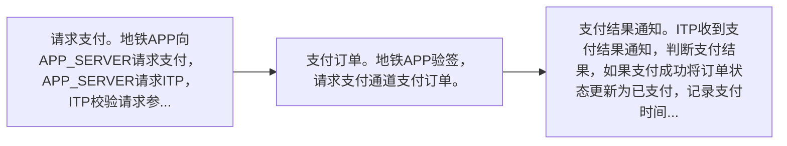

# IF8A-23 请求添加支付通道

> 来源：`10-业务规范与标准/原始归档/青岛地铁-ITP与APP接口规范R6.docx`

## 接口地址

`http//:[ip]:[port]/[project]/ ci/app/requestAddPayChannel`

## 流程说明

- 请求支付。地铁APP向APP_SERVER请求支付，APP_SERVER请求ITP，ITP校验请求参数合法性，若参数不合法则返回错误码8001。如果参数合法创建订单，根据支付通道编码payChannelCode，创建商户订单号，请求对应的支付通道预下单，将预下单返回的支付信息签名，将签名后的订单信息返回。
- 支付订单。地铁APP验签，请求支付通道支付订单。
- 支付结果通知。ITP收到支付结果通知，判断支付结果，如果支付成功将订单状态更新为已支付，记录支付时间，支付金额等。

> 注：流程图基于原始文档图16，具体步骤请参考上方流程说明。

## 请求参数

| 字段 | 类型 | 说明 |
| --- | --- | --- |
| blackList | Json数组 | 黑名单列表, 最多25笔 |

## 应答参数

| 字段 | 类型 | 说明 |
| --- | --- | --- |
| thirdUserId | string | 第三方用户id |
| cardId | String | 地铁会员卡号 |
| cardType | String | 2.8	卡类型编码 |
| blackListType | String | 解约结果 1：加入黑名单 2：移除黑名单 |
| optionDate | String | 操作时间时间, 格式如： YYYYMMDDHH24mmss |
| expireTime | String | 黑名单有效期, 格式如： YYYYMMDDHH24mmss。 当解约结果为1时有效 |
