# IF8A-24 请求设置默认支付通道

> 来源：`10-业务规范与标准/原始归档/青岛地铁-ITP与APP接口规范R6.docx`

## 接口地址

`http//:[ip]:[port]/[project]/ ci/app/requestSetDefaultPayChannel`

## 流程说明

- 用户在已经签约的支付通道列选择要设置的默认的支付通道。
- 地铁APP请求设置默认支付通道接口，ITP设置用户默认支付通道。
- 设置默认通道成功后，客户端发起请求行业数据接口。
- 接口传送的逻辑卡号不存在，接口返回没有账号卡片数据。
- 接口传送要设置的支付通道未签约，接口返回无效的签约数据。
- 接口传送要设置的支付通道解约中，接口返回解约审核中。
- 后付费HCE业务
- 请求开户HCE后付费
- 请求开户HCE后付费流程详见图12。

```mermaid
flowchart LR
    Step0[用户在已经签约的支付通道列选择要设置的默认的支付通道。]
    Step1[地铁APP请求设置默认支付通道接口，ITP设置用户默认支付通道。]
    Step2[设置默认通道成功后，客户端发起请求行业数据接口。]
    Step3[接口传送的逻辑卡号不存在，接口返回没有账号卡片数据。]
    Step4[接口传送要设置的支付通道未签约，接口返回无效的签约数据。]
    Step5[接口传送要设置的支付通道解约中，接口返回解约审核中。]
    Step6[后付费HCE业务]
    Step7[请求开户HCE后付费]
    Step8[请求开户HCE后付费流程详见图12。]
    Step0 --> Step1
    Step1 --> Step2
    Step2 --> Step3
    Step3 --> Step4
    Step4 --> Step5
    Step5 --> Step6
    Step6 --> Step7
    Step7 --> Step8
```

> 注：流程图基于原始文档图11，具体步骤请参考上方流程说明。

## 请求参数

| 字段 | 类型 | 说明 |
| --- | --- | --- |
| retCode | string | 返回码 |
| retMsg | string | 返回消息 |

## 应答参数

| 字段 | 类型 | 说明 |
| --- | --- | --- |
| orderNo | string | 订单号 |
| refundType | string | 00: 用户提交退款 01：超时未使用自动退款 |
| refundResult | string | SUCCESS/FAIL/PROCESSING SUCCESS—退款成功 FAIL—退款失败 PROCESSING-退款进行中 |
| refundResultDesc | string | 退款描述 |
| refundDate | string | 退款日期 |
| refundAmount | String | 退款金额 单位分 |
| orderType | String | 订单类型  单程票0 普通日票1 全城通日票2 |
