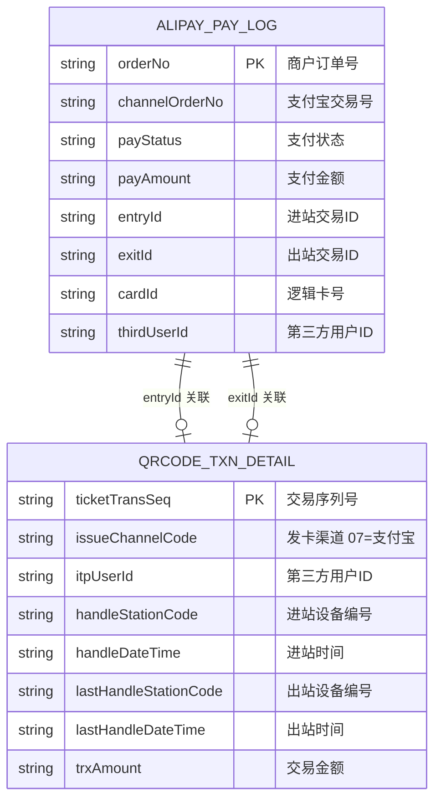
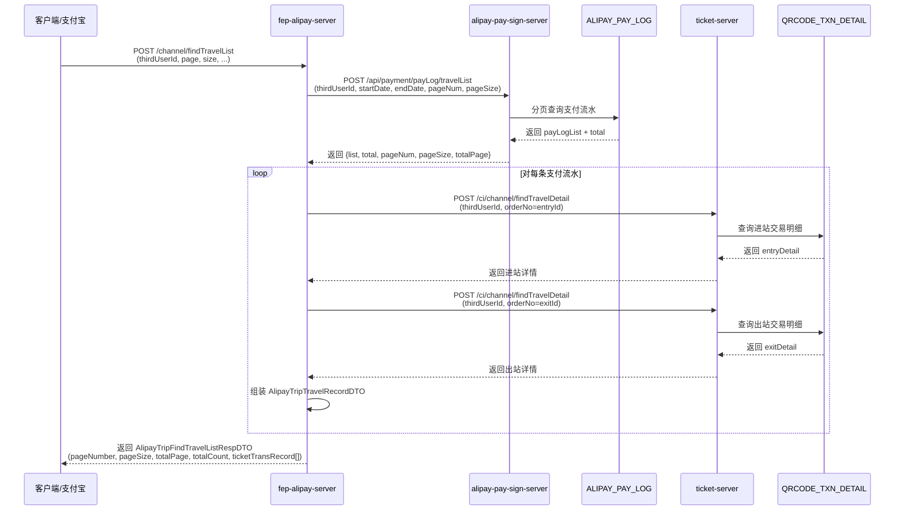

# 支付宝出行-查询乘车记录调用链路图

> 对应接口：`/channel/findTravelList`  
> 实现方案：方案 B（分页列表 + 进出站详情补全）  
> 更新时间：2026-07-21

---

## 完整调用流程图

```mermaid
flowchart TD
    Start([客户端/支付宝<br>POST /channel/findTravelList]) --> ParseBiz[FepAlipayTripController<br>解析 CommonFormRequest.bizData]
    ParseBiz --> Validate{参数校验<br>thirdUserId 非空?}
    
    Validate -->|否| ReturnInvalid[返回 8001 无效参数]
    Validate -->|是| CalcPage[计算分页参数<br>pageNum = page<br>pageSize = size]
    
    CalcPage --> CallPaySign[调用 alipay-pay-sign-server<br>POST /api/payment/payLog/travelList]
    
    subgraph alipay-pay-sign-server
        CallPaySign --> PayLogCtrl[AlipayPayLogController<br>/api/payment/payLog/travelList]
        PayLogCtrl --> PayLogSvc[AlipayPaySignService<br>selectAlipayPayLogListForTravel]
        PayLogSvc --> QueryDB[(ALIPAY_PAY_LOG 表<br>分页查询)]
        QueryDB --> BuildList[组装响应<br>list / total / pageNum / pageSize / totalPage]
        BuildList --> ReturnPayLogs[返回支付流水列表]
    end
    
    ReturnPayLogs --> CheckEmpty{支付流水列表<br>为空?}
    CheckEmpty -->|是| ReturnEmpty[返回空列表]
    CheckEmpty -->|否| LoopStart[开始循环<br>遍历每条支付流水]
    
    subgraph 循环组装每条乘车记录
        LoopStart --> GetPayLog[获取当前支付流水<br>orderNo / entryId / exitId<br>channelOrderNo / payStatus]
        
        GetPayLog --> CheckEntry{entryId<br>非空?}
        CheckEntry -->|是| CallEntryDetail[调用 ticket-server<br>POST /ci/channel/findTravelDetail<br>orderNo = entryId]
        CheckEntry -->|否| SkipEntry[跳过进站查询]
        
        CallEntryDetail --> TicketEntryCtrl[ticket-server<br>AlipayTripController]
        TicketEntryCtrl --> TicketEntrySvc[TicketTransServiceImpl<br>alipayTripFindTravelDetail]
        TicketEntrySvc --> QueryEntryDB[(QRCODE_TXN_DETAIL 表<br>ISSUE_CHANNEL_CODE='07')]
        QueryEntryDB --> EntryDetail[返回进站详情<br>entryStationName / entryDate]
        
        SkipEntry --> CheckExit
        EntryDetail --> CheckExit
        
        CheckExit{exitId<br>非空?}
        CheckExit -->|是| CallExitDetail[调用 ticket-server<br>POST /ci/channel/findTravelDetail<br>orderNo = exitId]
        CheckExit -->|否| SkipExit[跳过出站查询]
        
        CallExitDetail --> TicketExitCtrl[ticket-server<br>AlipayTripController]
        TicketExitCtrl --> TicketExitSvc[TicketTransServiceImpl<br>alipayTripFindTravelDetail]
        TicketExitSvc --> QueryExitDB[(QRCODE_TXN_DETAIL 表<br>ISSUE_CHANNEL_CODE='07')]
        QueryExitDB --> ExitDetail[返回出站详情<br>exitStationName / exitDate<br>payAmount / totalAmount]
        
        SkipExit --> BuildRecord
        ExitDetail --> BuildRecord[组装 AlipayTripTravelRecordDTO<br>进出站信息 + 支付信息]
        
        BuildRecord --> AddToList[添加到记录列表]
        AddToList --> LoopNext{还有更多<br>支付流水?}
        LoopNext -->|是| GetPayLog
        LoopNext -->|否| LoopEnd[循环结束]
    end
    
    LoopEnd --> AssembleResp[组装最终响应<br>retCode / retMsg / pageNumber<br>pageSize / totalPage / totalCount<br>ticketTransRecord[]]
    ReturnEmpty --> AssembleResp
    
    AssembleResp --> Return([返回响应])
    
    style Start fill:#e1f5ff
    style Return fill:#e8f5e9
    style alipay-pay-sign-server fill:#fff3e0
    style 循环组装每条乘车记录 fill:#f3e5f5
    
    style QueryDB fill:#ffebee
    style QueryEntryDB fill:#ffebee
    style QueryExitDB fill:#ffebee
```

---

## 核心接口清单

| 接口 | 方法 | 路径 | 服务 | 说明 |
|------|------|------|------|------|
| 查询乘车记录列表 | POST | `/channel/findTravelList` | fep-alipay-server | 入口接口 |
| 查询支付流水列表 | GET/POST | `/api/payment/payLog/travelList` | alipay-pay-sign-server | 分页查 ALIPAY_PAY_LOG |
| 查询进出站详情 | POST | `/ci/channel/findTravelDetail` | ticket-server | 查 QRCODE_TXN_DETAIL |

---

## 数据表关系



---

## 调用时序图



---

## 关键代码位置

| 组件 | 文件 | 关键方法/端点 |
|------|------|---------------|
| **入口 Controller** | `fep-alipay-server/.../FepAlipayTripController.java` | `POST /channel/findTravelList` |
| **业务编排** | `fep-alipay-server/.../AlipayTripServiceImpl.java` | `findTravelList()`、`buildTravelRecord()` |
| **RPC 客户端** | `rpc/.../AlipayPaySignClient.java` | `selectAlipayPayLogListForTravel()` |
| **支付流水 Controller** | `alipay-pay-sign-server/.../AlipayPayLogController.java` | `GET/POST /api/payment/payLog/travelList` |
| **支付流水 Service** | `alipay-pay-sign-server/.../AlipayPaySignService.java` | `selectAlipayPayLogListForTravel()` |
| **支付流水 Mapper** | `alipay-pay-sign-server/.../AlipayPayLogMapper.java` | `selectAlipayPayLogListForTravel()` |
| **详情查询 Controller** | `ticket-server/.../AlipayTripController.java` | `POST /ci/channel/findTravelDetail` |
| **详情查询 Service** | `ticket-server/.../TicketTransServiceImpl.java` | `alipayTripFindTravelDetail()` |

---

## 数据流转示例

```
请求参数:
  thirdUserId = "支付宝用户ID"
  page = "0"
  size = "10"
  startDate = "20240101"
  endDate = "20240131"

Step 1: alipay-pay-sign-server 返回
  list = [
    {orderNo: "M20240101001", channelOrderNo: "20240101001", payStatus: "SUCCESS", entryId: "卡号202401010101", exitId: "卡号202401010102"},
    {orderNo: "M20240101002", channelOrderNo: "20240101002", payStatus: "SUCCESS", entryId: "卡号202401010201", exitId: "卡号202401010202"}
  ]
  total = 2
  pageNum = 0
  pageSize = 10
  totalPage = 1

Step 2: 循环调用 ticket-server
  对 orderNo="M20240101001":
    entryId="卡号202401010101" → ticket-server → entryStationName="青岛北站", entryDate="2024-01-01 08:30:00"
    exitId="卡号202401010102"  → ticket-server → exitStationName="五四广场站", exitDate="2024-01-01 09:15:00"
  
  对 orderNo="M20240101002":
    entryId="卡号202401010201" → ticket-server → entryStationName="青岛站", entryDate="2024-01-02 10:00:00"
    exitId="卡号202401010202"  → ticket-server → exitStationName="青岛北站", exitDate="2024-01-02 10:45:00"

Step 3: 最终响应
  ticketTransRecord = [
    {
      entryStationName: "青岛北站",
      entryDate: "2024-01-01 08:30:00",
      exitStationName: "五四广场站",
      exitDate: "2024-01-01 09:15:00",
      payAmount: "500",
      totalAmount: "500",
      tradeOrderNo: "M20240101001",
      payTradeOrderNo: "20240101001",
      payChannelCode: "07",
      debitRequestResult: "SUCCESS"
    },
    ...
  ]
```

---

## 异常处理

| 异常场景 | 处理方式 | 返回码 |
|----------|---------|--------|
| thirdUserId 为空 | 直接返回错误 | 8001 |
| alipay-pay-sign-server 返回空 | 返回系统错误 | 9999 |
| ticket-server 调用异常 | 记录日志，该条记录不加入列表 | 继续处理其他记录 |
| 部分字段查询失败 | 只填充成功查询到的字段 | 继续处理 |
