# 支付宝乘坐地铁 — 业务流图

## 一、总览架构

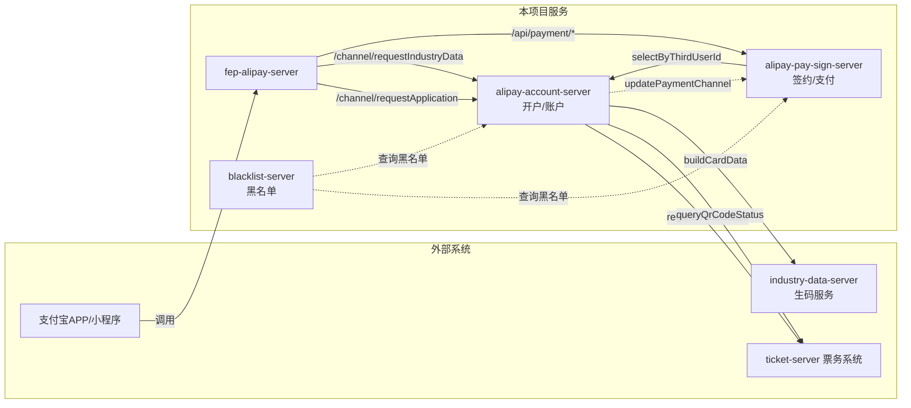

> **说明：**
> - `fep-alipay-server` 是对外网关，本仓库维护的是其后端三个微服务。
> - `alipay-account-server` 负责开卡、用户信息维护、行业数据获取。
> - `alipay-pay-sign-server` 负责支付宝代扣签约/解约、支付、退款、查询。
> - `industry-data-server` 负责生成乘车码卡数据（HexString）。
> - `blacklist-server` 负责卡号黑名单管理，供其他服务联动查询。

---

## 二、完整业务泳道图（粗粒度）

> 以下泳道图覆盖用户从"开通乘车码 → 打开二维码 → 签约代扣 → 乘车扣款 → 查询 → 退款 → 解约"的完整生命周期。
> 每个参与者独立泳道，只展示主要流程步骤，省略内部细节。

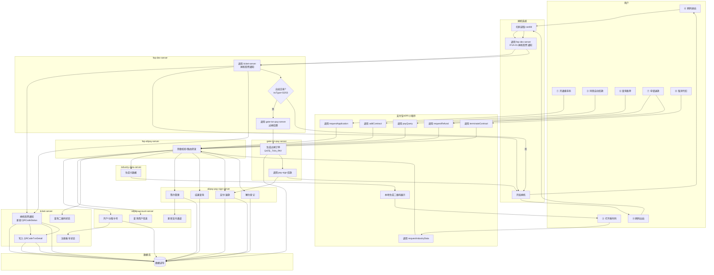

### 时序说明

| 序号 | 步骤 | 调用方 | 服务端 | 说明 |
|------|------|--------|--------|------|
| ① | 开通乘车码 | 用户 → 支付宝 | fep → account-server → ticket-server | 首次开通，分配逻辑卡号 |
| ② | 打开乘车码 | 用户 → 支付宝 | fep → account-server → ticket-server → industry-data-server | 获取卡数据，本地生成二维码 |
| ③ | 同意自动扣扣 | 用户 → 支付宝 | fep → pay-sign-server → account-server | 开通免密代扣协议 |
| ④ | 刷码进站 | 闸机系统 | fep-dev-server → ticket-server | 闸机扫码，更新票卡状态为"已进站"（codeStatus=04），记录进站时间、站点 |
| ⑤ | 刷码出站 | 闸机系统 | fep-dev-server → ticket-server → gate-txn-pay-server → pay-sign-server | 闸机扫码，更新票卡状态为"已出站"（codeStatus=05/06），生成过闸订单，发起免密扣款 |
| ⑥ | 查询账单 | 用户 → 支付宝 | fep → pay-sign-server | 查询支付结果 |
| ⑦ | 申请退款 | 用户 → 支付宝 | fep → pay-sign-server | 退款到支付宝余额 |
| ⑧ | 取消代扣 | 用户 → 支付宝 | fep → pay-sign-server | 登记解约请求 |

> **闸机进出站说明**：
> - **进站（trxType=01）**：闸机调用 `fep-dev-server` 的 IF1A-01 接口，`fep-dev-server` 调用 `ticket-server` 的 `/ci/app/notiVerifyResult`，更新 `QRCodeStatus` 状态为 `04`（已进站），记录 `gateInTime`、`gateInStation`，写入 `QRCodeTxnDetail` 交易明细。
> - **出站（trxType=02/03）**：闸机调用 `fep-dev-server` 的 IF1A-01 接口，`fep-dev-server` 先调用 `ticket-server` 更新状态为 `05`/`06`（已出站），若出站交易成功则继续调用 `gate-txn-pay-server` 的 `/ci/gateTxnPay/requestPay` 生成过闸订单 `GATE_TXN_PAY`，由 `gate-txn-pay-server` 调用 `pay-sign-server` 发起免密扣款。

---

## 三、核心业务流程泳道图

### 流程 1：开卡申请（requestApplication）

> 用户首次在支付宝开通地铁乘车码，需完成开户并分配逻辑卡号。

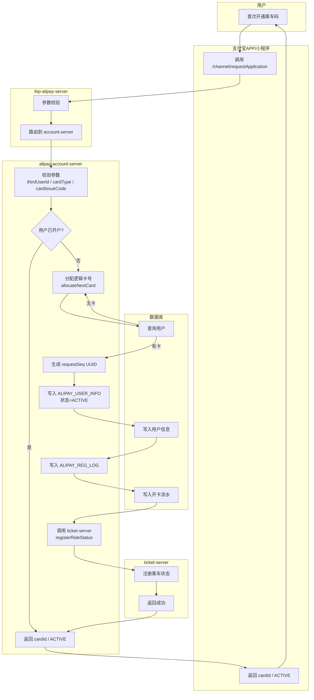

---

### 流程 2：获取行业数据/生码（requestIndustryData）

> 用户在支付宝小程序/APP 打开乘车码时，系统生成乘车码卡数据（HexString），前端基于此数据动态生成二维码。

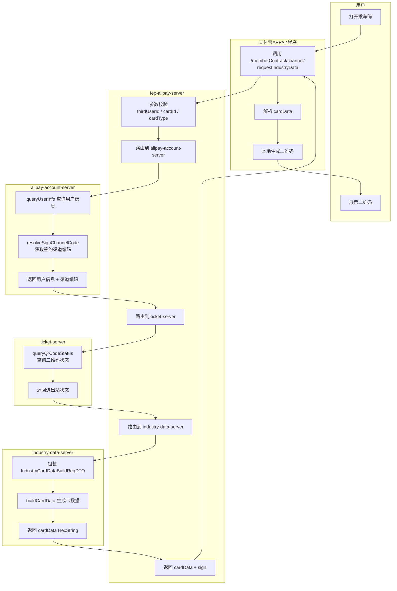

---

### 流程 3：签约（addContract）— 支付宝代扣协议开通

> 用户在支付宝内同意开通"自动扣款"协议，系统记录签约信息并补充支付通道。

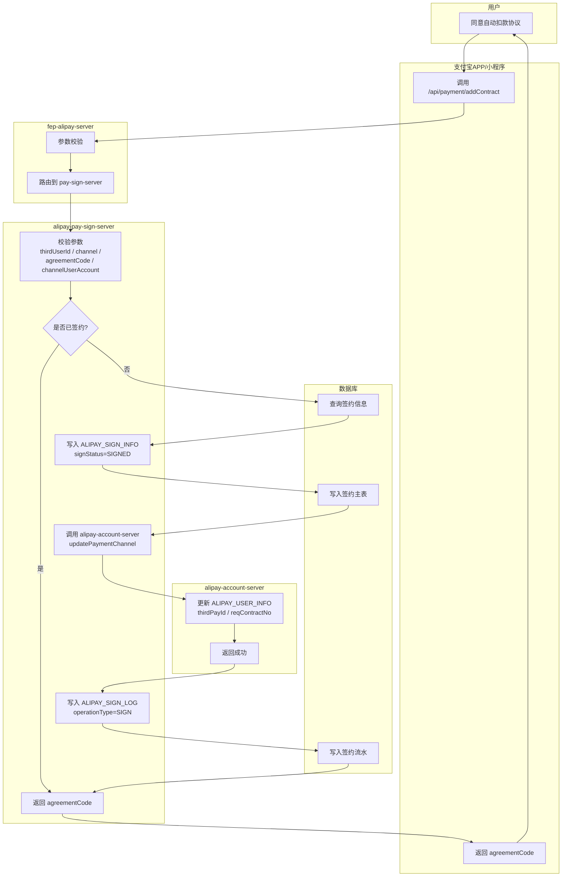

---

### 流程 4：解约登记（terminateContract）

> 用户在支付宝端取消代扣协议，系统登记解约请求（状态 PENDING，由外部系统后续处理实际解约）。

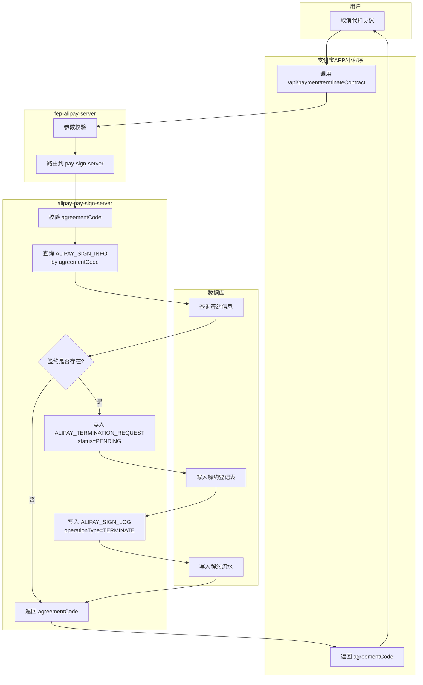

---

### 流程 5：闸机进站（IF1A-01）— 更新票卡状态

> 用户刷码进站，闸机调用 ticket-server 更新票卡状态为"已进站"，记录进站时间、站点，写入交易明细。

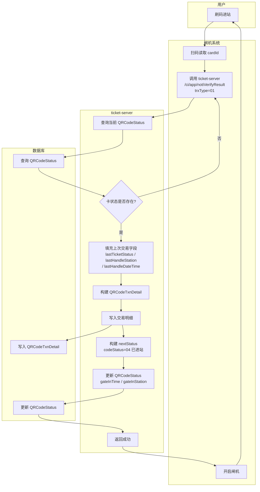

**涉及接口与表：**
| 接口 | 服务 | 数据库表 |
|------|------|----------|
| `POST /ci/app/notiVerifyResult` | ticket-server | `qrcode_status`, `qrcode_txn_detail` |

**关键字段说明：**
| 字段 | 说明 |
|------|------|
| `trxType=01` | 进站交易 |
| `codeStatus=04` | 已进站 |
| `gateInTime` | 进站时间 |
| `gateInStation` | 进站站点 |
| `lastTicketStatus` | 上次票卡状态 |
| `lastHandleStationCode` | 上次处理站点 |
| `lastHandleDateTime` | 上次处理时间 |

---

### 流程 6：闸机出站扣款（IF1A-01 + gate-txn-pay）— 出站扣费

> 用户刷码出站，闸机先调用 ticket-server 更新票卡状态，再调用 gate-txn-pay-server 生成过闸订单并发起免密扣款。

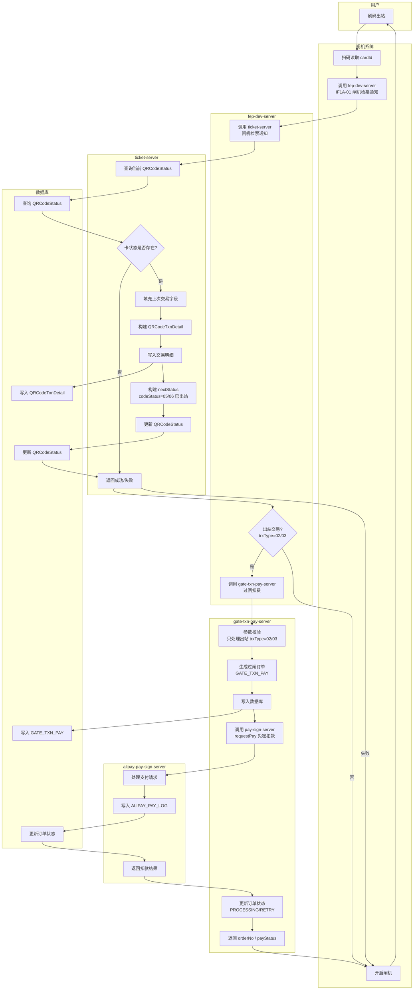

**涉及接口与表：**
| 接口 | 服务 | 数据库表 |
|------|------|----------|
| `POST /ci/app/notiVerifyResult` | ticket-server | `qrcode_status`, `qrcode_txn_detail` |
| `POST /ci/gateTxnPay/requestPay` | gate-txn-pay-server | `gate_txn_pay` |

**关键字段说明：**
| 字段 | 说明 |
|------|------|
| `trxType=02` | 出站交易 |
| `trxType=03` | 超时出站交易 |
| `codeStatus=05/06` | 已出站 |
| `orderNo=GT + 时间戳 + cardId后6位` | 过闸订单号 |
| `debitStatus=PROCESSING` | 扣款处理中 |
| `debitStatus=RETRY` | 扣款失败待重试 |

---

### 流程 7：支付申请（requestPay）— 支付宝主动支付

> 用户通过支付宝主动发起支付（非闸机扫码场景），系统校验签约状态后发起扣款。

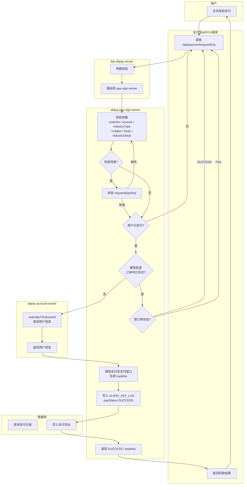

---

### 流程 8：支付结果查询（payQuery）

> 查询某订单号的支付状态。

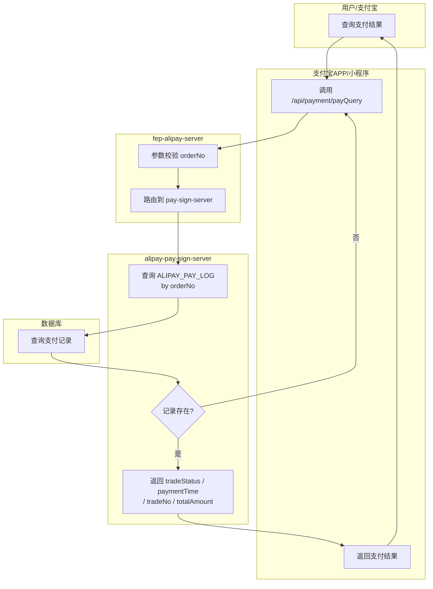

---

### 流程 9：退款申请（requestRefund）

> 对已支付成功的订单发起退款（支持部分退款，累加退款金额不超过原订单金额）。

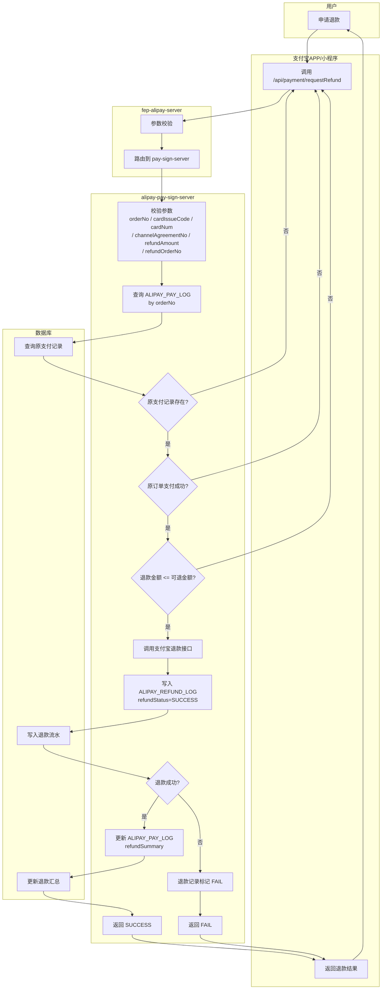

---

### 流程 10：黑名单管理（Blacklist）

> 管理异常卡号的黑名单，供其他服务联动拦截。

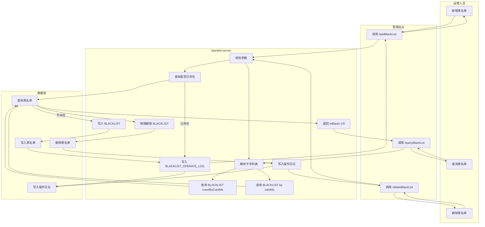

---

## 三、完整业务时序图

以下时序图覆盖从"用户开通乘车码 → 打开二维码 → 乘车扣款 → 退款"的完整链路。

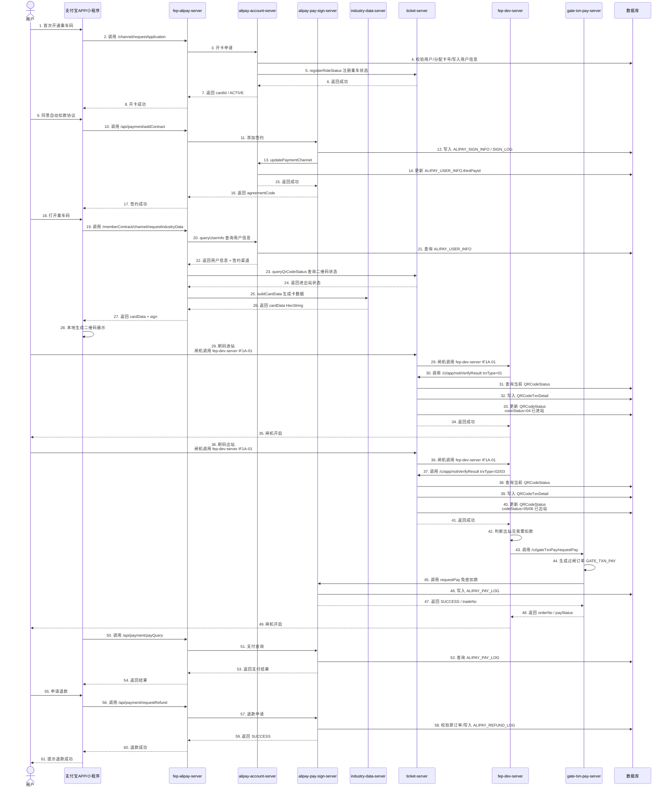

---

## 四、数据库实体关系概览

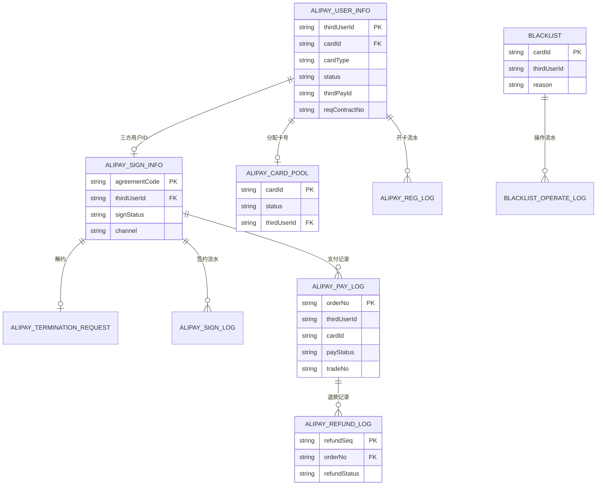

---

## 五、核心接口清单

| 接口路径 | HTTP 方法 | 服务 | 功能 |
|----------|-----------|------|------|
| `/channel/requestApplication` | POST | alipay-account-server | 开卡申请 |
| `/memberContract/channel/requestIndustryData` | POST | fep-alipay-server | 获取行业数据/生码 |
| `/api/payment/addContract` | POST | alipay-pay-sign-server | 签约（开通代扣） |
| `/api/payment/terminateContract` | POST | alipay-pay-sign-server | 解约登记 |
| `/api/payment/requestPay` | POST | alipay-pay-sign-server | 支付申请（扣款） |
| `/api/payment/payQuery` | POST | alipay-pay-sign-server | 支付结果查询 |
| `/api/payment/requestRefund` | POST | alipay-pay-sign-server | 退款申请 |
| `/queryBlackList` | POST | blacklist-server | 查询黑名单 |
| `/addBlackList` | POST | blacklist-server | 新增黑名单 |
| `/deleteBlackList` | POST | blacklist-server | 删除黑名单 |

---

## 六、补充说明

### 6.1 获取行业数据接口详解

`/memberContract/channel/requestIndustryData` 是支付宝出行渠道的核心接口，用于在用户打开乘车码时获取卡数据。

**调用时机：**
- 用户打开支付宝乘车码页面时
- 用户下拉刷新二维码时
- 二维码过期需要重新生成时

**返回数据用途：**
```
cardData (HexString) → 支付宝前端解析 → 生成动态二维码 → 用户刷码
```

**关键流程：**
1. 查询用户信息（account-server）
2. 查询二维码状态（ticket-server）
3. 生成卡数据（industry-data-server）
4. 返回 `cardData` + `sign`

### 6.2 二维码生成机制

| 环节 | 说明 |
|------|------|
| **后端生成** | `industry-data-server` 生成 `cardData`（HexString），包含卡号、状态、时间戳等 |
| **前端生成** | 支付宝小程序/APP 基于 `cardData` 本地生成二维码图片 |
| **闸机识别** | 闸机扫码后解析二维码内容，获取 cardId 进行验证 |
| **动态刷新** | 二维码定期刷新（通常60秒），每次刷新重新调用 `requestIndustryData` |

---

*文档生成时间：2026-07-02*
*基于代码仓库 `/qditp` 中 `alipay-account-server`、`alipay-pay-sign-server`、`blacklist-server`、`fep-alipay-server` 等模块梳理。*
