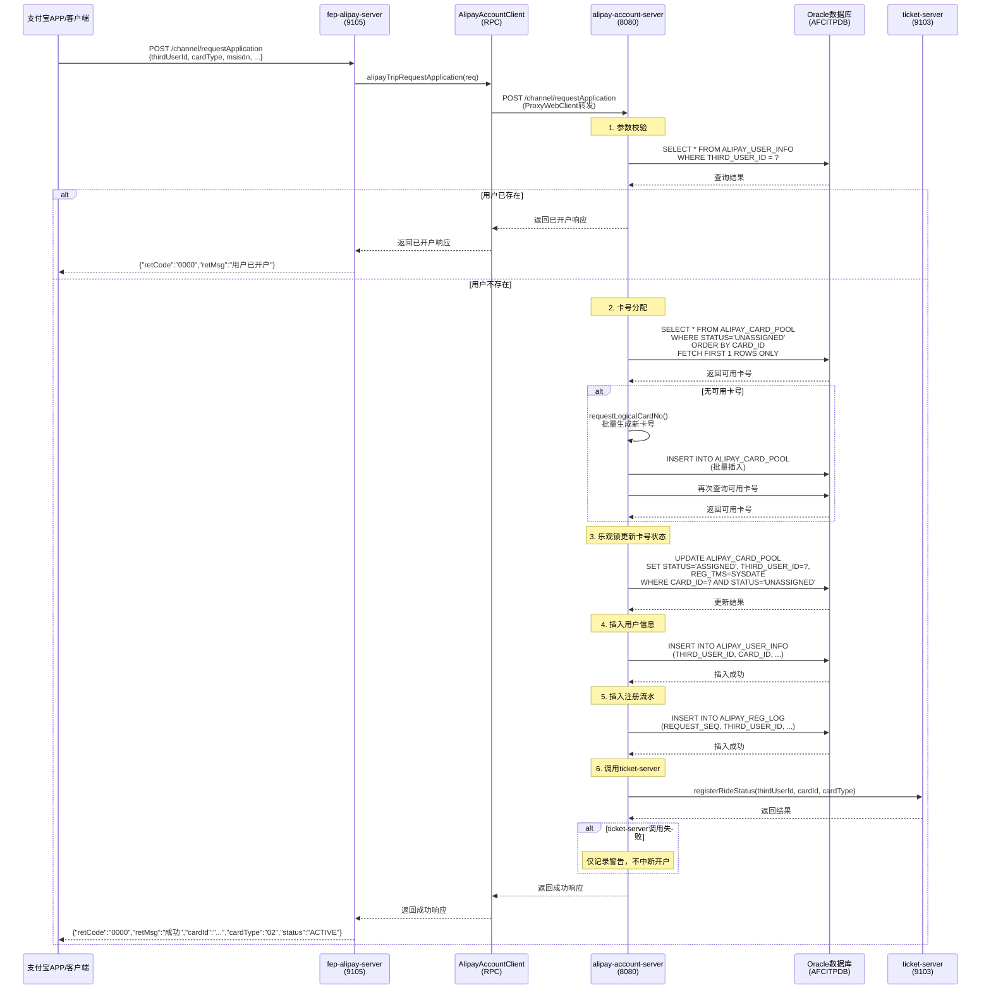

# 支付宝出行开卡申请接口时序图与副作用

## 1. 时序图



## 2. 副作用清单

### 2.1 数据库写入（Oracle AFCITPDB）

| 表名 | 操作 | 时机 | 说明 |
|------|------|------|------|
| ALIPAY_USER_INFO | INSERT | 开户成功时 | 写入用户主表信息 |
| ALIPAY_REG_LOG | INSERT | 开户成功时 | 写入开卡申请流水 |
| ALIPAY_CARD_POOL | UPDATE | 分配卡号时 | 状态从 UNASSIGNED → ASSIGNED |
| ALIPAY_CARD_POOL | INSERT | 卡号池不足时 | 批量生成新卡号（260701093052000001格式） |

### 2.2 远程调用

| 调用方向 | 目标服务 | 接口 | 说明 |
|----------|----------|------|------|
| fep-alipay-server → alipay-account-server | /channel/requestApplication | RPC调用 | 通过AlipayAccountClient |
| alipay-account-server → ticket-server | registerRideStatus | RPC调用 | 注册乘车状态 |

### 2.3 副作用说明

1. **卡号池自动补充**
   - 触发条件：`ALIPAY_CARD_POOL` 中 `STATUS='UNASSIGNED'` 的记录数 ≤ 10
   - 执行动作：批量生成 20 张新卡号，格式为 `QD` + YYMMDD + HHMMSS + 6位序列
   - 插入表：`ALIPAY_CARD_POOL`

2. **乐观锁更新**
   - 防止并发分配同一张卡号
   - 更新条件：`WHERE CARD_ID=? AND STATUS='UNASSIGNED'`
   - 如果更新失败（updated=0），重试最多3次

3. **ticket-server 失败处理**
   - 失败时**不中断开户流程**
   - 仅记录警告日志：`调用 ticket-server 注册乘车状态失败`
   - 用户表和流水表已经写入成功

4. **重复开户判断**
   - 查询 `ALIPAY_USER_INFO` 是否存在 `THIRD_USER_ID`
   - 存在则直接返回已开户，不再分配新卡号

## 3. 调用链路总览

```
支付宝APP
  ↓ POST /channel/requestApplication
fep-alipay-server (9105)
  ↓ RPC: AlipayAccountClient.alipayTripRequestApplication()
alipay-account-server (8080)
  ↓ 1. 参数校验
  ↓ 2. 重复开户检查 → ALIPAY_USER_INFO
  ↓ 3. 卡号分配 → ALIPAY_CARD_POOL (UPDATE)
  ↓ 4. 插入用户 → ALIPAY_USER_INFO (INSERT)
  ↓ 5. 插入流水 → ALIPAY_REG_LOG (INSERT)
  ↓ 6. 调用ticket → ticket-server
  ↓ 返回响应
fep-alipay-server
  ↓ 返回响应
支付宝APP
```

## 4. 数据流向

```
请求参数 (thirdUserId, cardType, msisdn, ...)
  ↓
ALIPAY_USER_INFO (用户主表)
ALIPAY_REG_LOG (流水表)
ALIPAY_CARD_POOL (卡号池表，状态更新)
  ↓
响应 (retCode, retMsg, cardId, cardType, status)
```

## 5. 错误处理

| 错误场景 | 错误码 | 处理方式 |
|----------|--------|----------|
| 参数校验失败 | 8001 | 直接返回，不操作数据库 |
| 用户已开户 | 0000 | 返回已开户信息，不重复开户 |
| 无可分配卡资源 | 9999 | 返回失败，记录警告 |
| ticket-server调用失败 | 0000 | 仅记录警告，开户仍成功 |
| 系统异常 | 9001 | 返回系统错误 |

## 6. 配置项影响

| 配置项 | 影响范围 | 说明 |
|--------|----------|------|
| alipay.card-pool.debug-manual-allocate | 卡号分配 | true时直接返回调试卡号，不查卡池 |
| alipay.card-pool.debug-manual-card-id | 卡号分配 | 调试模式下使用的固定卡号 |
| alipay.card-pool.threshold | 卡号池监控 | 未使用卡号≤此值时自动申请 |
| alipay.card-pool.batch-size | 卡号池补充 | 自动申请时一次性补充的数量 |
| service.ticket.url | ticket调用 | ticket-server地址 |
